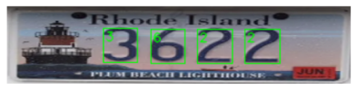
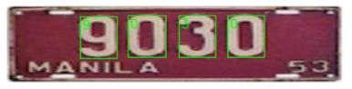
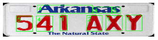
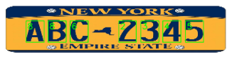

# License Plate Digit Classification

This repository contains a digit classification model trained on the MNIST dataset for license plate digit recognition using PyTorch. The model is designed to classify only numerical digits (0-9), although real-world license plates may also contain letters. Additionally, a contour-based detection algorithm with Non-Maximum Suppression (NMS) is implemented to accurately identify distinct character regions in the license plate before classification.

## Model Architecture

The model consists of a convolutional neural network (CNN) with the following architecture:

```
----------------------------------------------------------------
        Layer (type)               Output Shape         Param #
================================================================
            Conv2d-1           [-1, 16, 28, 28]             160
              ReLU-2           [-1, 16, 28, 28]               0
         MaxPool2d-3           [-1, 16, 14, 14]               0
            Conv2d-4           [-1, 32, 14, 14]           4,640
              ReLU-5           [-1, 32, 14, 14]               0
         MaxPool2d-6             [-1, 32, 7, 7]               0
            Linear-7                  [-1, 512]         803,328
              ReLU-8                  [-1, 512]               0
            Linear-9                  [-1, 128]          65,664
             ReLU-10                  [-1, 128]               0
           Linear-11                   [-1, 64]           8,256
             ReLU-12                   [-1, 64]               0
           Linear-13                   [-1, 10]             650
================================================================
Total params: 882,698
Trainable params: 882,698
Non-trainable params: 0
----------------------------------------------------------------
Input size (MB): 0.00
Forward/backward pass size (MB): 0.33
Params size (MB): 3.37
Estimated Total Size (MB): 3.70
----------------------------------------------------------------
```

## Features
- **Digit Classification:** A CNN-based model trained on MNIST to classify digits from license plates.
- **Contour-based Detection:** A preprocessing step to identify and extract character regions from license plates.
- **Non-Maximum Suppression (NMS):** Applied to filter overlapping bounding boxes and improve accuracy.

## Installation
1. Clone this repository:
   ```bash
   git clone  https://github.com/das-sunanda/Digit-Classification-from-License-Plate.git
   cd Digit-Classification-from-License-Plate
   ```
2. Install dependencies:
   ```bash
   pip install -r requirements.txt
   ```

## Results
- The model achieves high accuracy on MNIST digits.
- The contour-based method effectively isolates digits for classification.
- NMS ensures minimal false detections.

## Sample Model Outputs
Here are some sample predictions from the trained model:

### Example 1


### Example 2


### Example 3


### Example 4


## Future Improvements
- Extend classification to include alphanumeric characters.
- Improve robustness to real-world license plate variations.
- Experiment with different CNN architectures for higher accuracy.


## Acknowledgments
- [PyTorch](https://pytorch.org/) for deep learning framework.
- [OpenCV](https://opencv.org/) for image processing.
- MNIST dataset for digit classification.

## License
This project is licensed under the MIT License.
